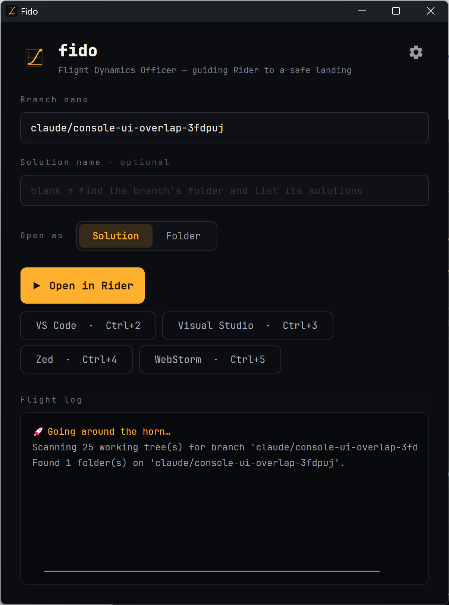
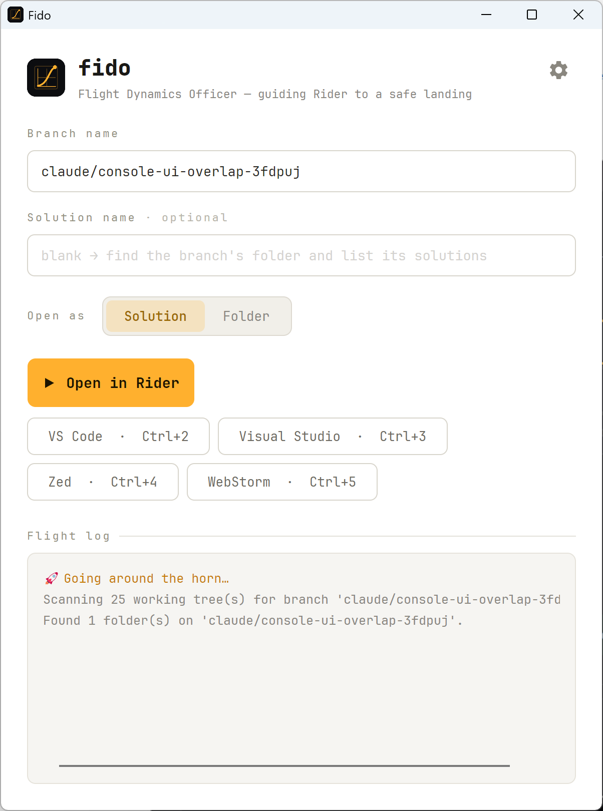
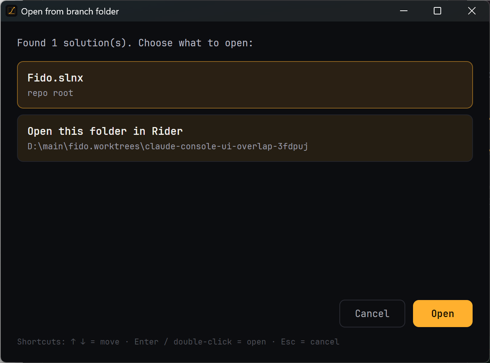
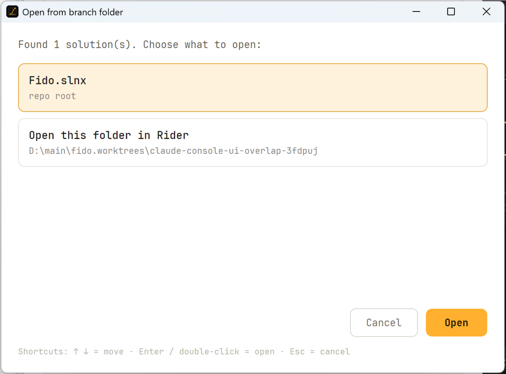
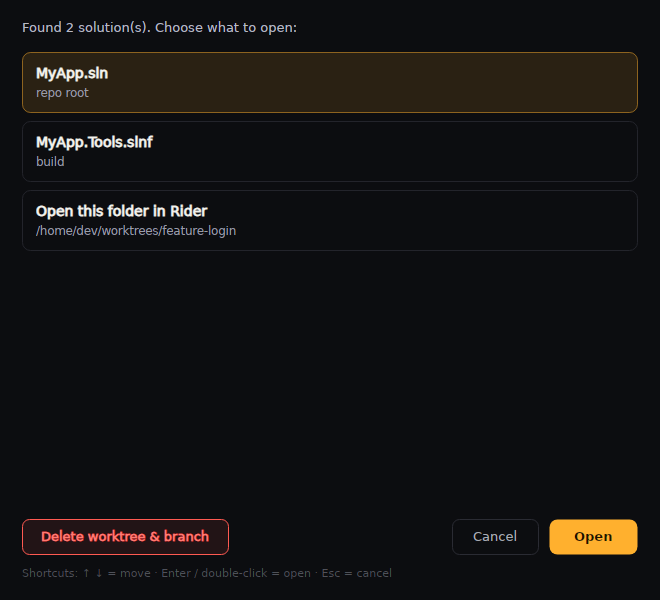
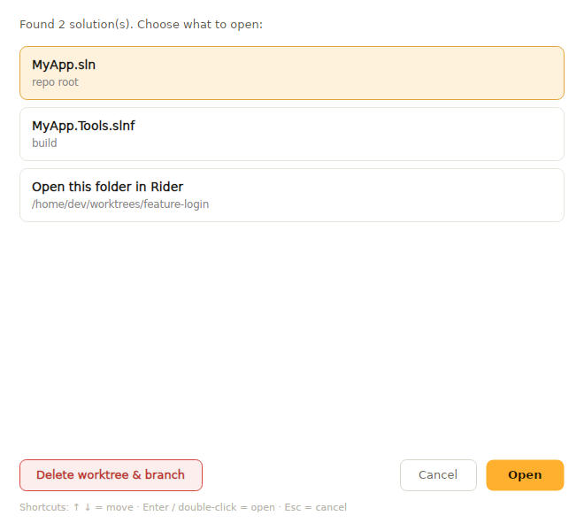
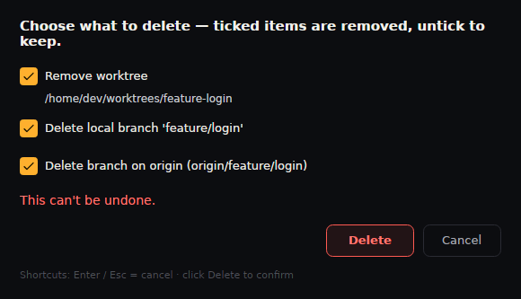
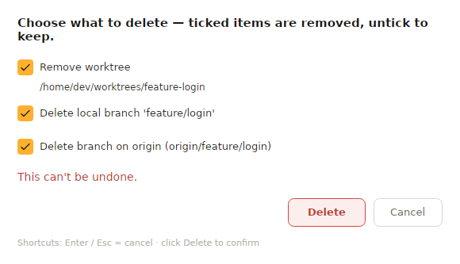
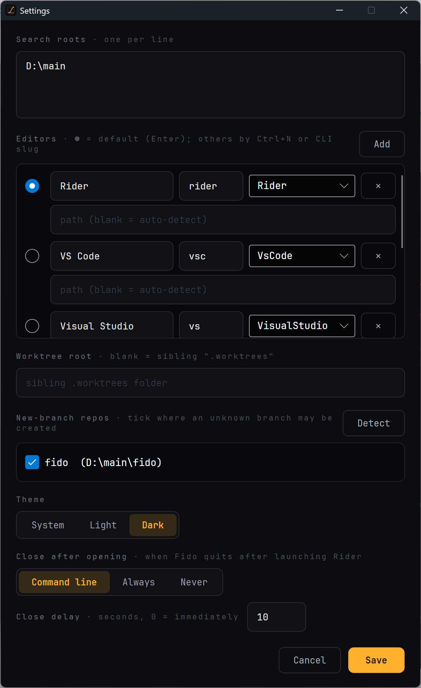
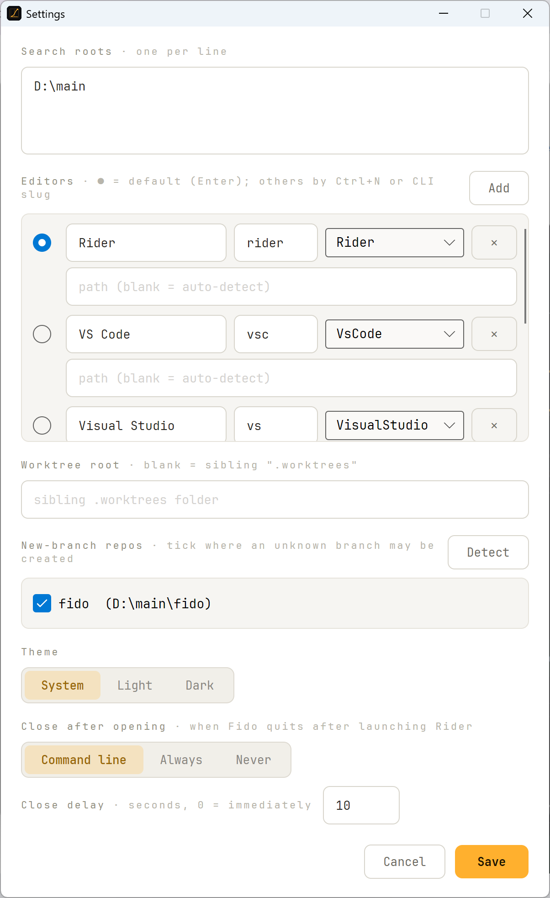

# Screenshots

A visual tour of **Fido** across its matching **dark** and **light** themes. The launch / GO
screen — *"The Eagle has landed"* — is featured on the [main README](../../README.md); see
**[Features](../Features.md)** for the full behaviour reference.

---

## Home screen

The mission-control console. Enter a **branch name**, optionally a **solution**, choose **Open
as** Solution or Folder, then launch your default editor with **Open** (Enter) — or any other
editor via its button and **Ctrl+1 … Ctrl+9**. The **Flight log** reports each step as Fido
"goes around the horn".

<table>
  <tr>
    <td align="center"><strong>Dark</strong></td>
    <td align="center"><strong>Light</strong></td>
  </tr>
  <tr>
    <td></td>
    <td></td>
  </tr>
</table>

---

## Open from branch folder

When a branch's folder contains more than one solution — or you'd rather open the repo root —
Fido asks what to open. Move with **↑ / ↓**, confirm with **Enter** or double-click, or back
out with **Esc**.

<table>
  <tr>
    <td align="center"><strong>Dark</strong></td>
    <td align="center"><strong>Light</strong></td>
  </tr>
  <tr>
    <td></td>
    <td></td>
  </tr>
</table>

---

## Delete a worktree

For a **linked worktree** on a non-default branch, the branch-folder chooser adds a **Delete worktree &
branch** button beside the open choices.

<table>
  <tr>
    <td align="center"><strong>Dark</strong></td>
    <td align="center"><strong>Light</strong></td>
  </tr>
  <tr>
    <td></td>
    <td></td>
  </tr>
</table>

Clicking it opens a confirmation dialog with a **checkbox for each present target** — the worktree, its
local branch, and the branch on `origin` — ticked by default. Untick any to keep it (keeping the worktree
disables deleting its branch), and Fido warns in red about uncommitted changes or commits that exist only on
the branch.

<table>
  <tr>
    <td align="center"><strong>Dark</strong></td>
    <td align="center"><strong>Light</strong></td>
  </tr>
  <tr>
    <td></td>
    <td></td>
  </tr>
</table>

---

## Settings

Configure **search roots**, your **editors** (each with a CLI slug, with the default marked
**●**), the **worktree root**, **new-branch repos**, **theme**, and the **close-after-opening**
behaviour and delay.

<table>
  <tr>
    <td align="center"><strong>Dark</strong></td>
    <td align="center"><strong>Light</strong></td>
  </tr>
  <tr>
    <td></td>
    <td></td>
  </tr>
</table>
