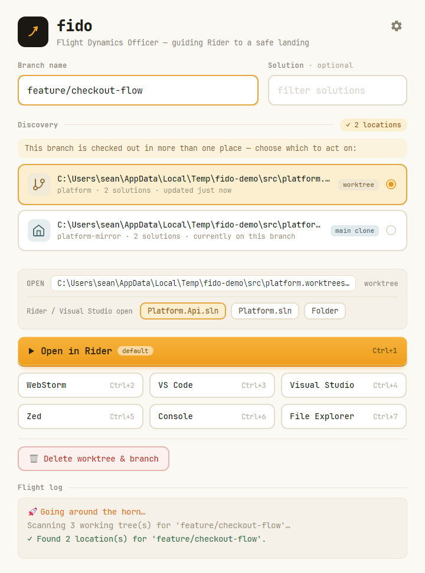
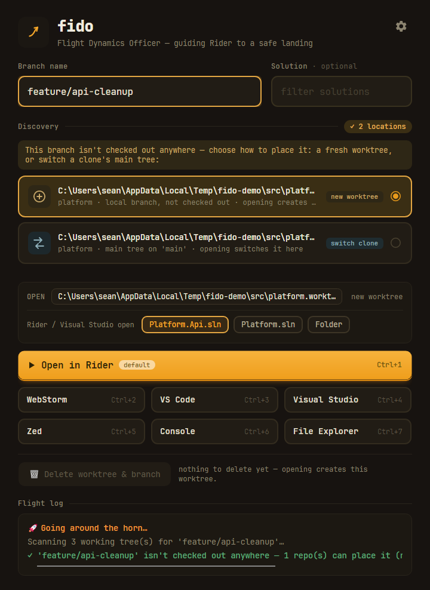
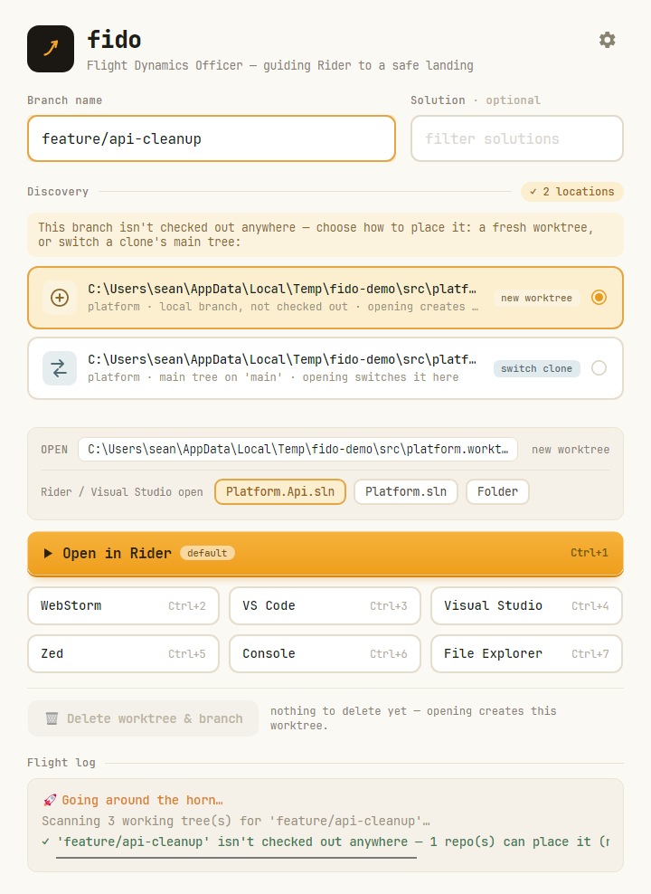
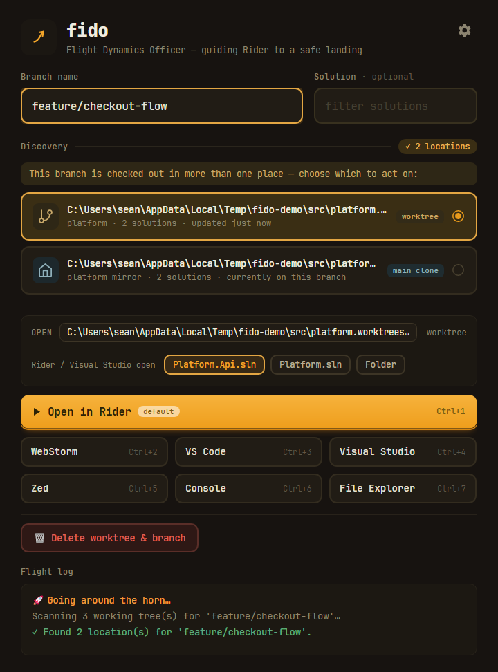
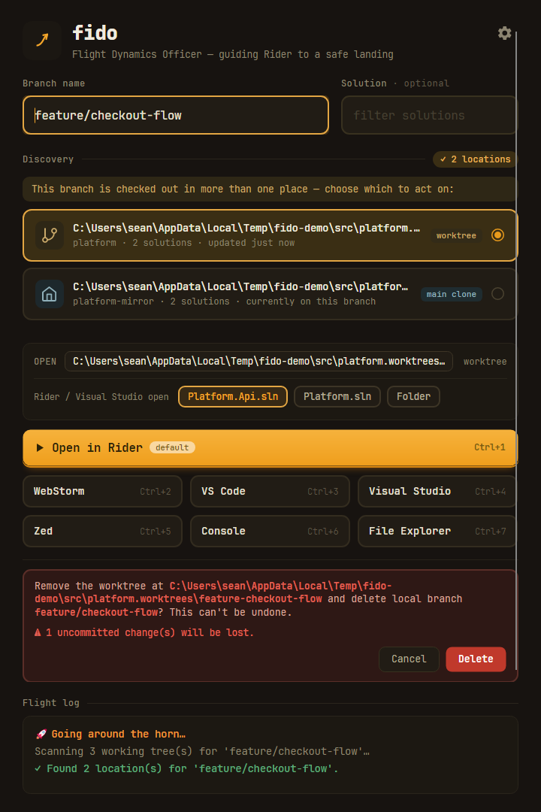
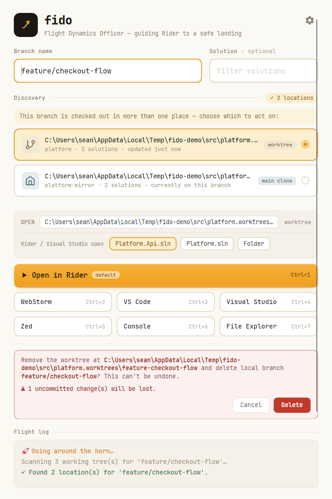
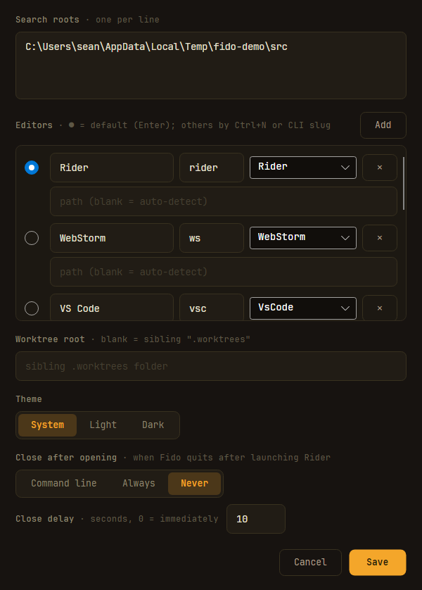
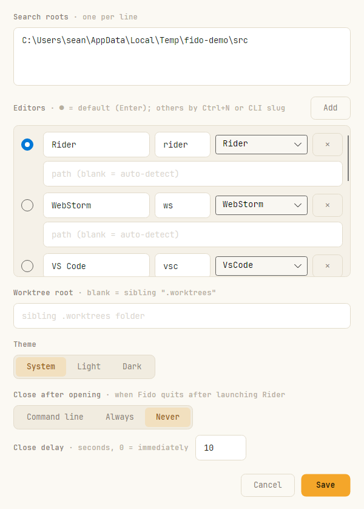

# Screenshots

A visual tour of **Fido** across its matching **dark** and **light** themes. The launch / GO
screen — *"The Eagle has landed"* — is featured on the [main README](../../README.md); see
**[Features](../Features.md)** for the full behaviour reference.

---

## Home screen

The mission-control console — one window, one screen. Type a **branch name** and Fido scans your
search roots for every working tree currently on it; the results render **inline** as selectable
cards. The **open actions** below stay locked until discovery finds the branch, then the big amber
button launches your **default tool** (the rest sit in the grid, **Ctrl+1 … Ctrl+9**). The
**Flight log** reports each step as Fido "goes around the horn".

<table>
  <tr>
    <td align="center"><strong>Dark</strong></td>
    <td align="center"><strong>Light</strong></td>
  </tr>
  <tr>
    <td></td>
    <td></td>
  </tr>
</table>

---

## Discovery results

When a branch is checked out in more than one place, every location gets its own card — labelled
**worktree** or **main clone**, worktrees first — and you choose which to act on. The context strip
shows the selected target with a **chip per detected solution** (plus **Folder**); Rider and Visual
Studio open the chosen chip, every other tool opens the folder. The **Solution** box filters the
chips.

<table>
  <tr>
    <td align="center"><strong>Dark</strong></td>
    <td align="center"><strong>Light</strong></td>
  </tr>
  <tr>
    <td></td>
    <td></td>
  </tr>
</table>

---

## Placing a branch that isn't checked out anywhere

When no working tree has the branch but a scanned clone's refs do (locally, on `origin`, or found by
a live `ls-remote` for a branch you never fetched), each such clone offers **two placement cards**:
a **new worktree** (leads, auto-selected) showing where it would be created, and a **switch clone**
that moves the clone's main tree onto the branch — warning inline when uncommitted changes would
ride along. Opening performs the placement first, then launches.

<table>
  <tr>
    <td align="center"><strong>Dark</strong></td>
    <td align="center"><strong>Light</strong></td>
  </tr>
  <tr>
    <td></td>
    <td></td>
  </tr>
</table>

---

## Delete a worktree

When the selected card is a **linked worktree** on a non-default branch, the **Delete worktree &
branch** button beneath the tools is live (selecting the main clone — or a default branch —
disables it with a note saying why).

<table>
  <tr>
    <td align="center"><strong>Dark</strong></td>
    <td align="center"><strong>Light</strong></td>
  </tr>
  <tr>
    <td></td>
    <td></td>
  </tr>
</table>

Clicking it swaps the button for an **inline confirm strip** that spells out exactly what happens —
remove the worktree and delete the **local** branch (the branch on `origin` is never touched) —
with warnings when the worktree has uncommitted changes or commits that exist only on that branch.
**Cancel** or **Esc** backs out; only the explicit **Delete** click confirms.

<table>
  <tr>
    <td align="center"><strong>Dark</strong></td>
    <td align="center"><strong>Light</strong></td>
  </tr>
  <tr>
    <td></td>
    <td></td>
  </tr>
</table>

---

## Settings

The ⚙ gear popover picks the **default tool** (or **No default** for the equal-weight grid);
**All settings…** opens the full dialog to configure **search roots**, your **editors** (each with
a CLI slug, with the default marked **●**), the **worktree root**, **theme**, and the
**close-after-opening** behaviour and delay.

<table>
  <tr>
    <td align="center"><strong>Dark</strong></td>
    <td align="center"><strong>Light</strong></td>
  </tr>
  <tr>
    <td></td>
    <td></td>
  </tr>
</table>
