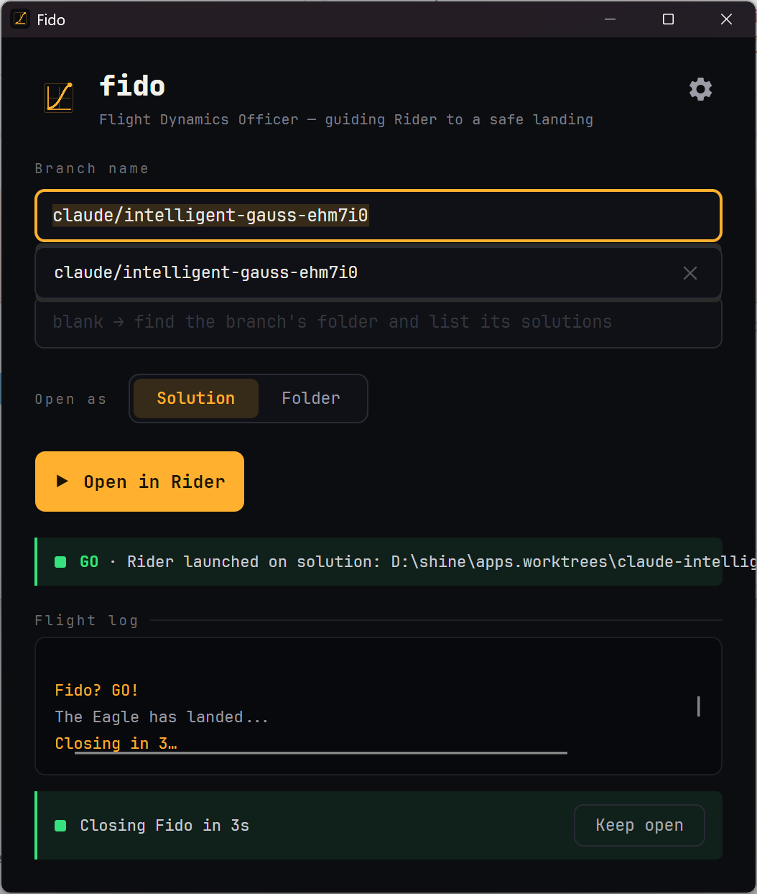

# Fido

**Fido** is a launch manager for your IDE — [**JetBrains Rider**](https://www.jetbrains.com/rider/),
[**VS Code**](https://code.visualstudio.com/), [**Visual Studio**](https://visualstudio.microsoft.com/), [**Zed**](https://zed.dev/), or any custom editor.

Give it a branch name; it locates the matching Git worktree on disk — switching or
creating one when needed — and opens the solution or repo folder in your editor. Pick a default
(opened with **Enter**); other editors are a **Ctrl+1 … Ctrl+9** away.

<p align="center">
  
</p>

---

## Why "Fido"? 🚀

When you're juggling a massive project spread across concurrent Git branches, hopping between context switches can feel like navigating through deep space. Finding the right local folder, verifying the worktree, and booting up your IDE takes manual steps you'd rather spend actually coding.

This application completely automates that trajectory. You give it a branch name; it automatically calculates the correct local Git worktree path, figures out if it needs to open a solution or a folder, and instantly fires it up in JetBrains Rider.

When looking for a name that captured that exact feeling of calculating a fast path and clearing a launch, we took inspiration from one of mankind’s greatest engineering achievements—and a legendary track that celebrates it.

---

### The Inspiration: Going Around the Horn

The name **Fido** is a direct tribute to the high-voltage track [Go! by Public Service Broadcasting](https://www.youtube.com/watch?v=BHIo6qwJarI) (check out the [lyrics here](https://genius.com/Public-service-broadcasting-go-lyrics)).

The song beautifully samples the original NASA archival audio from July 20, 1969. Just minutes before Apollo 11 was scheduled to touch down on the lunar surface, legendary Flight Director [Gene Kranz](https://en.wikipedia.org/wiki/Gene_Kranz) poll-checked his elite [White Team of flight controllers](https://www.google.com/search?q=https://en.wikipedia.org/wiki/Apollo_11_Mission_Control) to clear the spacecraft for its tense powered descent.

He went "around the horn," calling out the shortened acronyms of the room's console positions, asking if their systems were ready to land:

> **"Retro? GO! Fido? GO! Guidance? GO! Control? GO!..."**

---

### What does FIDO actually do?

In Mission Control, **FIDO** stands for the **Flight Dynamics Officer**.

```text
       [Your Branch] ────► [FIDO App] ────► [Rider IDE]
                                │
                 (Computes Worktree Trajectory)

```

The FIDO desk didn't watch a video feed or look out a window. They stared at dark cathode-ray screens filled with real-time mainframe data. Their lone, critical job was to **plot the exact path of the spacecraft through space, track its positioning nodes, and compute the vectors required to safely reach the destination.**

That is exactly what this tool does for your development workflow:

* **The Trajectory Check:** It takes your target branch name.
* **The Flight Path Vector:** It acts as your personal Flight Dynamics Officer, scanning your local directory infrastructure to map out the exact path to the matching worktree folder.
* **The Clearance:** It verifies whether to spin up the specific `.sln` file or the root directory.
* **The Launch:** It reports back **`Fido? GO!`** and hands off the controls to Rider instantly.

Instead of fighting the terminal or hunting through finder folders to switch contexts, you're just one quick command away from landing safely right inside your code.

---

> *"Eagle, we've got you on the data. You are GO for PDI."*
