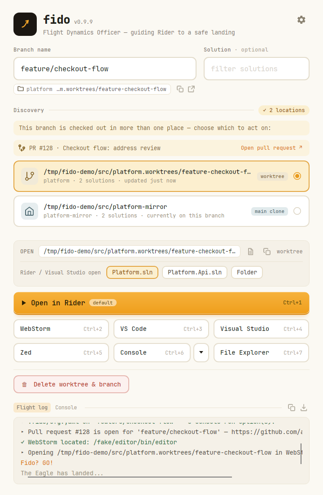
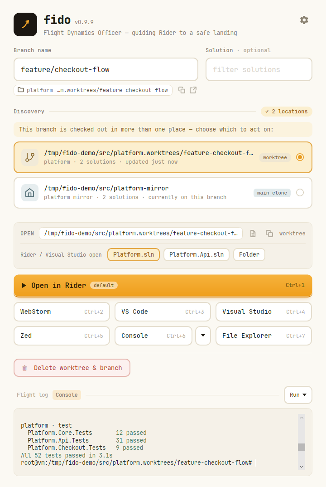

# Fido

**Fido** is a launch manager for your IDE — [**JetBrains Rider**](https://www.jetbrains.com/rider/),
[**WebStorm**](https://www.jetbrains.com/webstorm/), [**VS Code**](https://code.visualstudio.com/), [**Visual Studio**](https://visualstudio.microsoft.com/), [**Zed**](https://zed.dev/), or any custom editor.

**📖 [Full documentation](https://seankearon.github.io/fido/)**

Give it a branch name; it scans your repos for every **worktree** and **clone** currently on
that branch, lists them right on the main screen — clearly labelled — and opens your pick's
solution or folder in your editor. Set a **default tool** for the big Open button; every tool is a
**Ctrl+1 … Ctrl+9** away. It can also drop you into a **terminal** or open the folder in your
**file explorer** — on Windows, macOS, and Linux. Finished with a branch? Delete its worktree and
local branch — and, optionally, its remote branch too (unless an open PR says otherwise) — from the
same screen, with an inline confirm.

When a scan finds the branch, Fido also asks **GitHub** — through the **GitHub CLI (`gh`)** — whether
that branch has a **pull request open**, and puts a link to it right above the results: `PR #42 · Add the
widget`, one click to the browser. It asks again **every time it checks** — each scan, and again when you
arm a delete — so what you see is what GitHub says now, not what it said when you typed the name. The
check runs behind the results and never holds them up, and when `gh` can't answer at all the flight log
says so rather than implying the branch has no PR.

It also lists the **worktree folders that branch already has on disk**, right under the branch box — one
button from your clipboard and one from your **File Explorer / Finder**. A folder counts even when no
repo has the branch, so a leftover from last month is pointed out the moment you type the name; when
there's no folder anywhere, the line says nothing.

<p align="center">
  
</p>

<p align="center">
  <em>Fido? GO! — branch resolved, worktree located, editor launched. The Eagle has landed.</em>
</p>

---

## In-repo config

A repo can configure Fido for itself. Commit a **`.fido/cfg.yaml`** and Fido reads it off the branch a
scan just found, before the checkout options go up:

```yaml
prefer main clone: true   # default to opening the clone's own tree, not a worktree
commands:                 # offered on the Console run menus, in this order
  - build.ps1
  - aspire start
```

`prefer main clone` picks **which checkout Fido offers by default** after scanning — it directs the
choice, never the scan, so every location is still found and listed and each stays one click away. The
`commands` is an ordered list of command lines — whatever you'd type in a terminal there — and becomes a
run menu beside the **Console** button, and on the **Console tab**, running at the selected location.
Fido only ever *offers* them; nothing runs on its own.

It reads the file **off the branch, not just out of your folder**: your uncommitted edit first, then the
copy on `origin` whenever it differs from the one here, then the one this machine has. So a worktree made
before the config landed still gets it, and the flight log names the copy that answered — or says the
branch carries none, rather than leaving you guessing.

Don't hand-write it: the **OPEN** strip has a button that creates the file in the selected location and
opens it in your editor, seeded with the scripts Fido just found and every setting at its default — so
it changes nothing until you edit it, and an existing file is only ever opened, never overwritten. Full
reference in **[In-repo config](https://seankearon.github.io/fido/guide/in-repo-config/)**.

---

## The Console tab

The panel at the foot of the main screen carries two tabs. **Flight log** is Fido's narration —
what it scanned, what it found, what it opened. **Console** is a **real shell at the selected
location, running inside Fido**: over a real pseudo-terminal, so colour survives, prompts have
somewhere to type, **Ctrl+C** reaches the program, and a script that fails leaves its output on
screen with a live prompt underneath. Its **Run** menu leads with a plain *shell here* and then
offers whatever the branch's `.fido/cfg.yaml` nominated.

That is not the **Console *tool*** — the grid button (and CLI slug `term`) that opens **your**
terminal at the folder, which is still there and still the default for a run-menu pick. Which of
the two a pick uses is a setting; the full story is in
**[The Console tab](https://seankearon.github.io/fido/guide/console/)**.

<p align="center">
  
</p>

---

## Command-line launch

Fido pre-fills its form from the command line, and **giving it a branch starts discovery
immediately** — the same flow as typing the branch. Name a **tool** too and Fido auto-opens it, but
only when the branch is checked out in **exactly one** place; multiple locations are presented for
you to choose, never guessed between:

```text
fido feature/new-ui                    # scan for the branch and show every location
fido feature/new-ui rider              # …and auto-open in Rider if there's exactly one
fido feature/new-ui -s MyApp           # …with the solution chips filtered to MyApp
fido feature/new-ui term               # open a terminal on that branch (files = file explorer)
fido -b feature/new-ui -s MyApp -t vs  # the same, with explicit options
```

Each tool has a short **slug** (built-in: `rider`, `vsc`, `vs`, `zed`, plus `term` for a terminal and
`files` for the file explorer) that you can pass as the **second argument** — or explicitly with `-t` /
`--tool` (also `-e` / `--editor`) — and the built-in kinds answer to aliases like `vscode` or
`explorer` too. The named tool becomes the run's default (the hero button); `--tool none` shows the
equal-weight grid instead. Slugs are editable in **Settings**; an unknown id is called out in the
flight log rather than silently using the default. See **[the docs](https://seankearon.github.io/fido/)** for the
full reference.

---

## Screenshots

Fido ships with matching **dark** and **light** themes. Browse the full set — the home screen
with its inline discovery results, the delete confirm, the Console tab and settings — in the
**[screenshot gallery](https://seankearon.github.io/fido/screenshots/)**. Every shot is
generated by the test suite against a throwaway demo repo; see
**[Building](https://seankearon.github.io/fido/building/#the-screenshot-gallery)** for how to
regenerate them.

---

## Documentation

The full reference — discovery, opening, in-repo config, settings and the command line —
lives at **[seankearon.github.io/fido](https://seankearon.github.io/fido/)**.

It is built with [Zensical](https://zensical.org/) from the `docs/` folder in this
repository. **`release.ps1` builds and publishes it** — the *Verify Docs* stage builds the
site with `--strict` before anything is signed or tagged, so a broken link stops the
release, and *Publish Docs* force-pushes the result to the `gh-pages` branch that Pages
serves. [`.github/workflows/docs.yml`](.github/workflows/docs.yml) only validates the
build on pull requests; it does not publish.

That means the published site always describes the **released** version, not `main`.

Zensical needs to be on PATH on the release machine:

```powershell
uv tool install zensical    # or: pip install zensical
```

Set `ZENSICAL` to its full path if you keep it in a virtual environment, or pass
`-NoDocs` to release without touching the documentation. To preview locally:

```bash
zensical serve
```

---

## Why "Fido"? 🚀

When you're juggling a massive project spread across concurrent Git branches, hopping between context switches can feel like navigating through deep space. Finding the right local folder, verifying the worktree, and booting up your IDE takes manual steps you'd rather spend actually coding.

This application completely automates that trajectory. You give it a branch name; it automatically calculates the correct local Git worktree path, figures out if it needs to open a solution or a folder, and instantly fires it up in JetBrains Rider.

When looking for a name that captured that exact feeling of calculating a fast path and clearing a launch, we took inspiration from one of mankind’s greatest engineering achievements—and a legendary track that celebrates it.

---

### The Inspiration: Going Around the Horn

The name **Fido** is a direct tribute to the high-voltage track [Go! by Public Service Broadcasting](https://www.youtube.com/watch?v=BHIo6qwJarI) (check out the [lyrics here](https://genius.com/Public-service-broadcasting-go-lyrics)).

The song beautifully samples the original NASA archival audio from July 20, 1969. Just minutes before Apollo 11 was scheduled to touch down on the lunar surface, legendary Flight Director [Gene Kranz](https://en.wikipedia.org/wiki/Gene_Kranz) poll-checked his elite [White Team of flight controllers](https://www.google.com/search?q=https://en.wikipedia.org/wiki/Apollo_11_Mission_Control) to clear the spacecraft for its tense powered descent.

He went "around the horn," calling out the shortened acronyms of the room's console positions, asking if their systems were ready to land:

> **"Retro? GO! Fido? GO! Guidance? GO! Control? GO!..."**

---

### What does FIDO actually do?

In Mission Control, **FIDO** stands for the **Flight Dynamics Officer**.

```text
       [Your Branch] ────► [FIDO App] ────► [Rider IDE]
                                │
                 (Computes Worktree Trajectory)

```

The FIDO desk didn't watch a video feed or look out a window. They stared at dark cathode-ray screens filled with real-time mainframe data. Their lone, critical job was to **plot the exact path of the spacecraft through space, track its positioning nodes, and compute the vectors required to safely reach the destination.**

That is exactly what this tool does for your development workflow:

* **The Trajectory Check:** It takes your target branch name.
* **The Flight Path Vector:** It acts as your personal Flight Dynamics Officer, scanning your local directory infrastructure to map out the exact path to the matching worktree folder.
* **The Clearance:** It verifies whether to spin up the specific `.sln` file or the root directory.
* **The Launch:** It reports back **`Fido? GO!`** and hands off the controls to Rider instantly.

Instead of fighting the terminal or hunting through finder folders to switch contexts, you're just one quick command away from landing safely right inside your code.

---

> *"Eagle, we've got you on the data. You are GO for PDI."*
